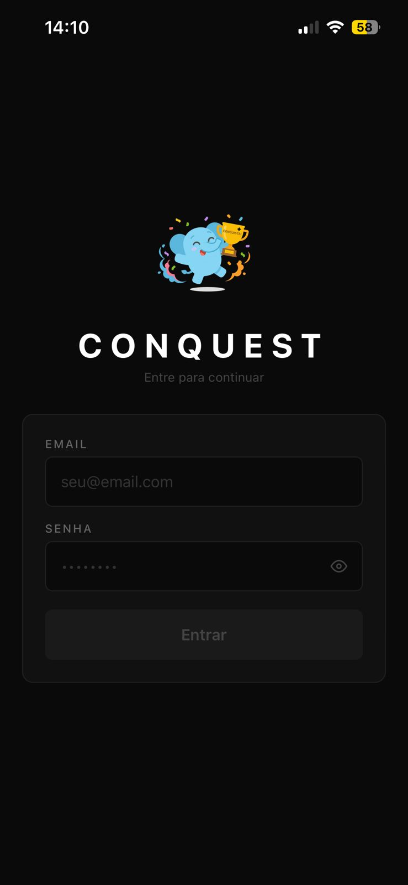
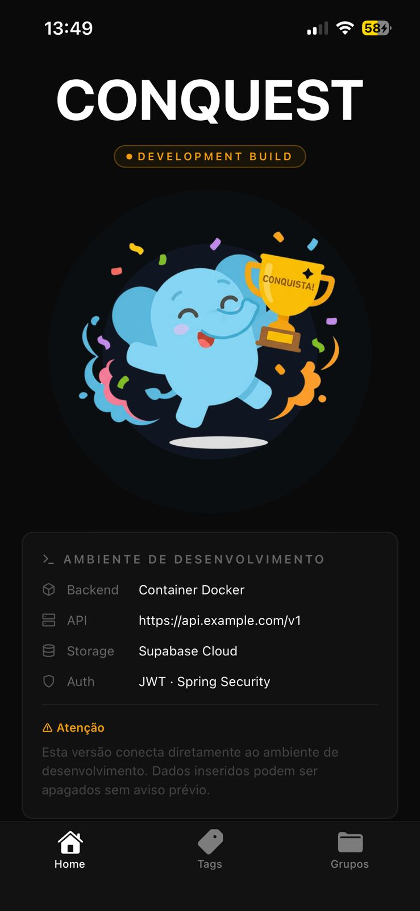
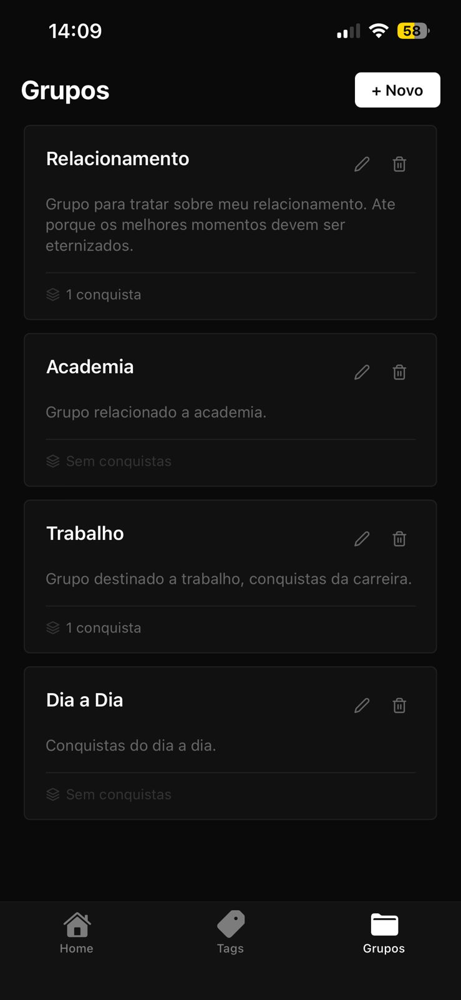
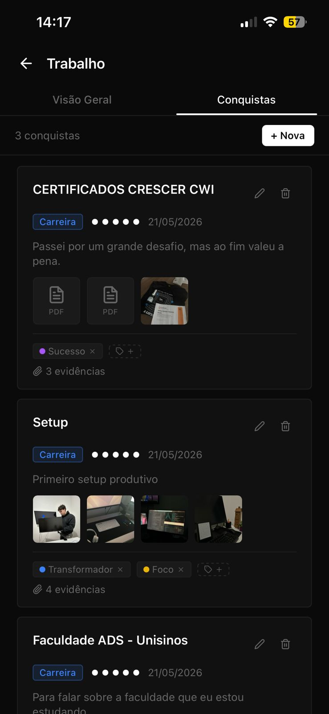
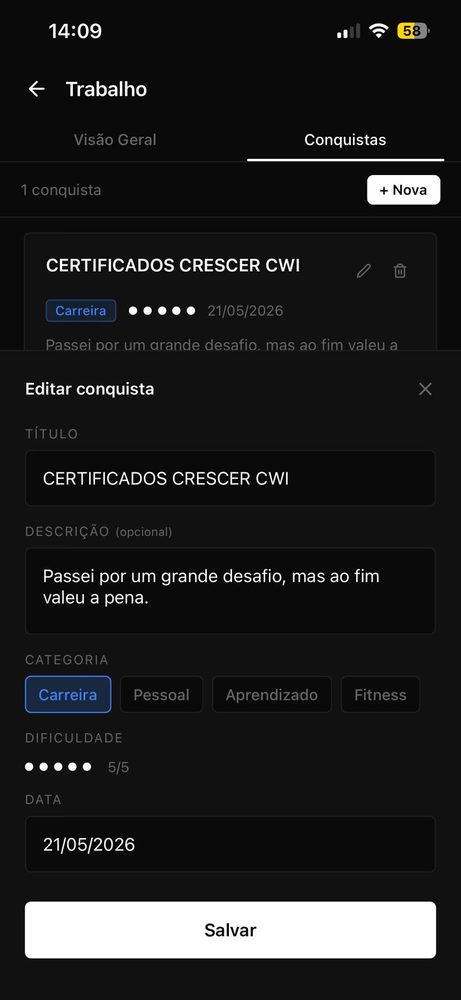
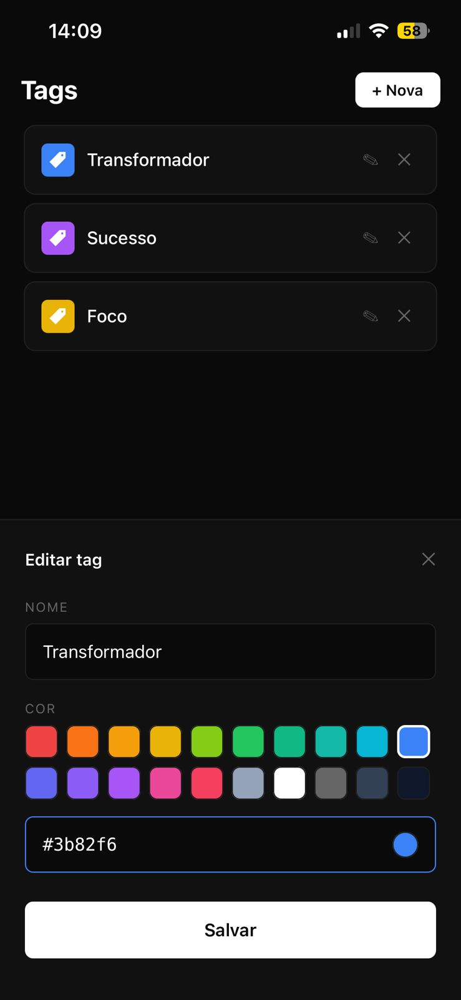

# Conquest

> Record and share achievements with your group.

Conquest is a mobile app that lets you create groups, log achievements with evidence, and organize them using tags.

## Screenshots

<div align="center">

  
  &nbsp;&nbsp;
  
  <br/><sub>Login &nbsp;&nbsp;&nbsp;&nbsp;&nbsp;&nbsp;&nbsp;&nbsp;&nbsp;&nbsp;&nbsp;&nbsp;&nbsp;&nbsp;&nbsp;&nbsp;&nbsp;&nbsp;&nbsp;&nbsp;&nbsp;&nbsp;&nbsp;&nbsp;&nbsp;&nbsp;&nbsp;&nbsp;&nbsp;&nbsp;&nbsp;&nbsp;&nbsp;&nbsp; Home</sub>

  <br/><br/>

  
  &nbsp;&nbsp;
  
  <br/><sub>Groups &nbsp;&nbsp;&nbsp;&nbsp;&nbsp;&nbsp;&nbsp;&nbsp;&nbsp;&nbsp;&nbsp;&nbsp;&nbsp;&nbsp;&nbsp;&nbsp;&nbsp;&nbsp;&nbsp;&nbsp;&nbsp;&nbsp;&nbsp;&nbsp;&nbsp;&nbsp;&nbsp;&nbsp;&nbsp;&nbsp; Achievements</sub>

  <br/><br/>

  
  &nbsp;&nbsp;
  
  <br/><sub>Create Achievement &nbsp;&nbsp;&nbsp;&nbsp;&nbsp;&nbsp;&nbsp;&nbsp;&nbsp;&nbsp;&nbsp;&nbsp;&nbsp;&nbsp;&nbsp;&nbsp;&nbsp;&nbsp; Tags</sub>

</div>

## Features

- **Authentication** — Secure login via JWT
- **Groups** — Create and manage achievement groups
- **Achievements** — Log achievements within a group
- **Tags** — Organize achievements with custom tags
- **Evidence** — Attach photos or documents as proof of achievements

## Stack

### Mobile (`conquest-app`)

| Technology | Description |
|-----------|-------------|
| Expo 54 | React Native platform |
| Expo Router v4 | File-based routing |
| GlueStack UI v3 | Component library |
| NativeWind v4 | Tailwind utilities for RN |
| Supabase JS | File storage |
| Axios | HTTP client |

### Backend (`conquest-backend`)

| Technology | Description |
|-----------|-------------|
| Spring Boot | Main framework |
| Java | Language |
| JPA / Hibernate | ORM |
| JWT | Authentication |

## Project Structure

```
project-1/
├── conquest-app/          # React Native app (Expo)
│   ├── app/
│   │   ├── (auth)/        # Login screen
│   │   ├── (tabs)/        # Main tabs (groups, tags)
│   │   └── group/         # Group details and achievements
│   ├── services/          # HTTP service layer
│   └── lib/               # Utilities
└── conquest-backend/      # REST API (Spring Boot)
    └── src/main/java/
        ├── controller/
        ├── service/
        ├── entity/
        ├── dto/
        └── repository/
```

## API Endpoints

### Auth

| Method | Route | Description |
|--------|-------|-------------|
| POST | `/v1/auth/sign-in` | Sign in |

### Groups

| Method | Route | Description |
|--------|-------|-------------|
| POST | `/v1/groups` | Create group |
| GET | `/v1/groups` | List groups |
| DELETE | `/v1/groups/{id}` | Delete group |

### Tags

| Method | Route | Description |
|--------|-------|-------------|
| POST | `/v1/tags` | Create tag |
| GET | `/v1/tags` | List tags |
| DELETE | `/v1/tags/{id}` | Delete tag |

### Achievements

| Method | Route | Description |
|--------|-------|-------------|
| POST | `/v1/achievements/{groupId}` | Create achievement |
| GET | `/v1/achievements/{groupId}` | List group achievements |
| DELETE | `/v1/achievements/{groupId}/{achievementId}` | Delete achievement |
| POST | `/v1/achievements/{groupId}/{achievementId}/tags/{tagId}` | Add tag to achievement |
| DELETE | `/v1/achievements/{groupId}/{achievementId}/tags/{tagId}` | Remove tag from achievement |
| POST | `/v1/achievements/{groupId}/{achievementId}/evidences` | Add evidence |
| DELETE | `/v1/achievements/{groupId}/{achievementId}/evidences/{evidenceId}` | Remove evidence |

## Getting Started

### Backend

```bash
cd conquest-backend
./mvnw spring-boot:run
```

### Mobile

```bash
cd conquest-app
npm install
npx expo start
```
